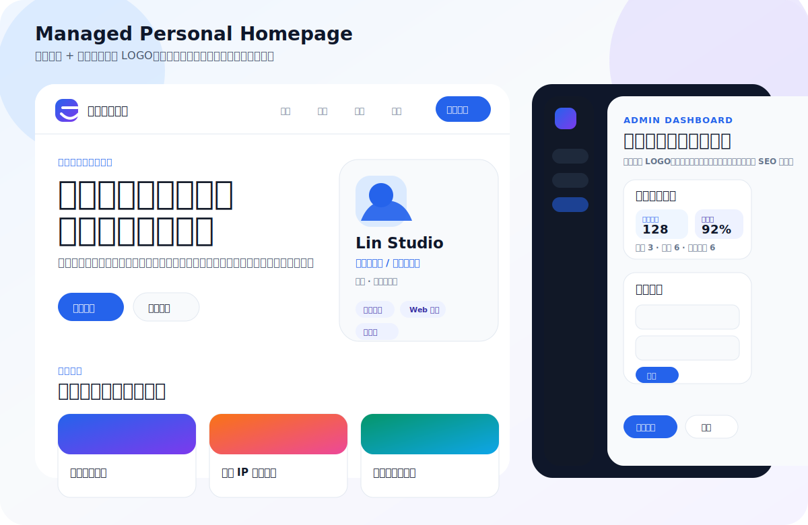

# Managed Personal Homepage

一个带内容管理后台的个人主页系统。前台用于展示个人品牌、头像、昵称、简介、作品、经历、技能和联系方式；后台用于集中编辑这些源信息，并通过浏览器本地存储即时发布到前台。



## 功能

- 前台个人主页：品牌 LOGO、导航、首屏介绍、个人资料、数据亮点、技能、作品、经历和联系方式。
- 后台管理面板：可编辑 LOGO、头像、昵称、作品、社交链接、SEO 等所有主要展示内容，并提供内容统计概览。
- 实时预览：后台内置移动端风格 iframe 预览。
- 内容导入导出：支持导出 JSON，也支持导入 JSON 复用内容。
- 无第三方依赖：使用原生 HTML、CSS、JavaScript 和 Node.js 静态服务器。

## 运行

```bash
npm start
```

打开：

- 前台：http://localhost:4173/
- 后台：http://localhost:4173/admin.html

## 访问统计说明

后台统计概览会显示本浏览器的前台访问次数、最近访问时间、最近保存时间、内容数量与资料完整度。当前实现使用 `localStorage`，适合单机预览和轻量模板；如果需要跨设备或真实线上访客分析，可以接入服务端数据库或第三方统计服务。

## 校验

```bash
npm test
```
